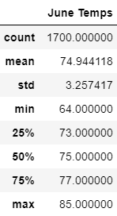
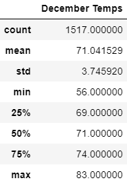

# surfs_up

## Overview of the Analysis
The purpose of this project is to analyze weather data from O'ahu, Hawaii in order to determine if it is feasible to open up a new store on the island without bad weather causing the store to run out of business. This analysis includes a statistical summary of the temperature for the months of June and December from the previous years. 

## Results
- The month of June has slightly more number of recorded temperatures than the month of December (1700 and 1517, respectively). Although this may not have a drastic effect on the overall comparison of the 2 months as they are both over 1500, it may be important to note for future reference.
- The month of June has had a slightly higher average temperature than the month of December (74.9 and 71.0, respectively). However, they are both within the 70-75 range which means that the overall temperature patterns of the two months are relatively similar.
- The min and max range for the month of June is slightly higher than that of the month of December (64-85 and 56-83, respectively). By looking at this range, along with the previous finding about average temperatures, it can be noted that June, on average, has slightly higher temperatures than December. However, as stated before, the temperatures differences are relatively small which means both months have similar tempaerature patterns.

## Summary 
### Challenge Results
The results from these 2 queries display that the temperature patterns for both the month of June and December are relatively similar. The overall range of averages of 71-74 shows that the weather during these times is what most individuals would consider comfortable when doing outdoor activities. This means that the chances of individuals in O'ahu being outside and surfing during these times is higher, which also means the Surf n' Turf shop has the potential to perform well financially in this area during this time. 
### Additional Queries
However, before making the final decision, I believe it would be beneficial to look at the precipitation summary statistics for the months of June and December, as well. If O'ahu experiences a lot of rain during these months, then it is quite possible that this new venture will be unsuccessful as there will not be customers to support it financially. In addition, it would be interesting to perform an additional query to determine how many days in each month on average the temperature is at the lower end of the min/max range and when it is at the higher end of the min/max range. If a substantial part of the days in each month are closer to 56 or 64, then it may be too cold for individuals to want to go surfing. This would also negatively affect the performance of the shop.  
